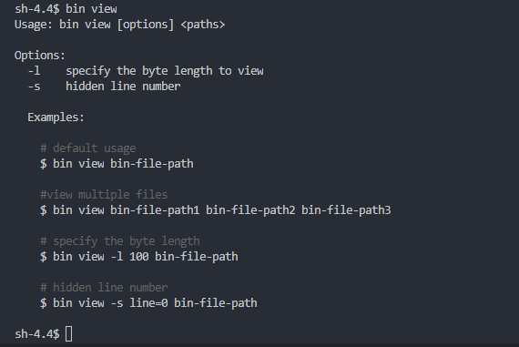

# bin-view

A simple command line tool for view binary files.

### Features
- View on console 
- Convert and save as *.txt

### Installation

Prerequisites: [Node.js](https://nodejs.org/en/) (>=6.x, 8.x preferred), npm version 3+.

```
npm install -g bin-view
```

### Usage

#### Basic usage
```
bin view bin-file-path1
```

#### View multiple files
```
bin view bin-file-path1 bin-file-path2 bin-file-path3
```

#### Convert to hexadecimal string, and saved in *.txt file
```
bin convert bin-file-path1 bin-file-path2 bin-file-path3
```

#### Just view the specify length of data
```
bin view bin-file-path1 bin-file-path2 bin-file-path3 -l 100
```

#### Hidden line number
```
bin view -s line=0 bin-file-path
```

### Demo

#### Print help


#### Result
